### Python for Everybody-Course 1: 

### Programming for Everybody (Getting Started with Python)

#### Chapter 1-Why me program

Q1*: When Python is running in the interactive mode and displaying the chevron prompt (>>>) - what question is Python asking you?  **What Python statement would you like me to run?**

Q2: What will the following program print out:  **20**

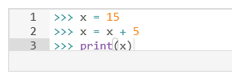

Q3: Python scripts (files) have names that end with:  **.py**

Q4: Which of these words is a reserved word in Python ?  **33个**

Q5: What is the proper way to say “good-bye” to Python?  **quit()**

Q6: Which of the parts of a computer actually executes the program instructions?  **Central Processing Unit**

Q7: What is "code" in the context of this course?  **A sequence of instructions in a programming language**

Q8: A USB memory stick is an example of which of the following components of computer architecture?  

**Secondary Memory**

Q9: What is the best way to think about a "Syntax Error" while programming?  

**The computer did not understand the statement that you entered**

Q10: Which of the following is **not** one of the programming patterns covered in Chapter 1?

Repeated Steps   Sequential Steps   **Random Steps**   Conditional Steps

---------------------------------------------------

**Optional Assignment: **Install and use Python

Requirement: Install Python and a programming text editor and write a program that prints one line other than 'hello world', then take two screen shots and upload them. You should use the command line to execute the Python program you wrote in the text editor.
										Pic1:

​										Pic2:

**Assignment:** Write a program that uses a **print** statement to say 'hello world'.

=======================================================================================

#### Chapter 2-Variables and Expressions

Constants  Variables  Reserved Words

注意变量命名规则、可使用助记符命名、运算优先级、变量类型及转换、输入语句、学会写注释

完整程序：输入、处理、输出

-----------------

Q11: In the following code: print(98.6)  What is "98.6" ?  **A constant**

Q11.1: Which of the following is a comment in Python?  **#This is a test**

Q12: What does the following code print out?   print("123" + "abc")   **123abc**

Q13: Which of the following is a bad Python variable name?

**#spam**   _spam   SPAM23   spam_23

Q14: Which of the following is not a Python reserved word?   **As shown in Q4**

Q15: Assume the variable x has been initialized to an integer value. What does the "x=x+2" do?  

**Retrieve the current value for x, add two to it, and put the sum back into x**

Q16: Which of the following elements of a mathematical expression in Python is evaluated first?

Multiplication*   Addition+   Subtraction-   **Parentheses()**

Q17: What is the value of 42 % 10 ?  **2,取余操作**

Q18: What will be the value of x after "x = 1 + 2 * 3 - 8 / 4" executes:  **5.0**

Q19: What will be the value of x when x = int(98.6) is executed:   **98,int向下取整**

Q20: What does the Python **input()** function do?  **Pause the program and read data from the user**

----------------

**Assignment 2.1: **

Write a program that uses **input** to prompt a user for their name and then welcomes them.

**Assignment 2.2: **

Write a program to prompt the user for hours and rate per hour using input to compute gross pay.  Use 35 hours and a rate of 2.75 per hour to test the program (the pay should be 96.25).  You should use **input** to read a string and **float()** to convert the string to a number.

=======================================================================================

#### Chapter 3-Conditional Code

条件结构if    比较运算符(不更改变量中的数值)&逻辑问题   缩进的重要性   

if语句的嵌套   if-else语句   elif关键词   if-elif 无else模块

try/except模块*：try语句执行有误时，执行except语句<捕捉traceback信息>，模块内尽量不要放太多语句

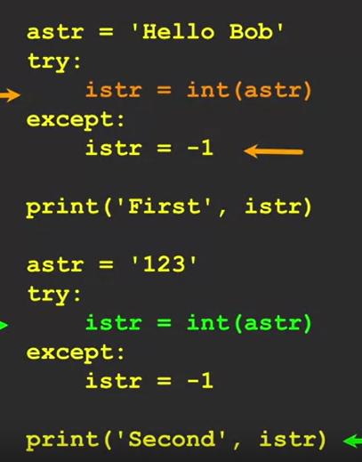

-----------------

Q21: What do we do to a Python statement that is immediately after an **if** statement to indicate that the statement is to be executed only when the **if** statement is **true**?  **Indent the line below the if statement**

Q22: Which of these operators is **not** a comparison / logical operator?   <=  >=  **=**  !=  ==

Q23: What is true about the following code segment: 

**Depending on the value of x, either all three of the print statements will execute or none of the statements will execute**

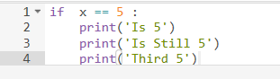

Q24: When you have multiple lines in an **if** block, how do you indicate the end of the **if** block?

**You de-indent the next line past the if block to the same level of indent as the original if statement**

Q25: It looks perfect but Python is giving you an 'Indentation Error' on the second print statement.  What is the most likely reason?  **You have mixed tabs and spaces in the file**

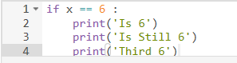

Q26: What is the Python reserved word that we use in two-way if tests to indicate the block of code that is to be executed if the logical test is false?  **else**

Q27: What will the following code print out?  **Small	All done**

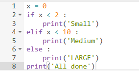

Q28: What value of 'x' will cause 'Something else' to print out?  

**This code will never print 'Something else' regardless of the value of 'x' **

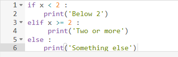

Q29*: In the following code (numbers added) - which will be the last line to execute successfully?  **1**

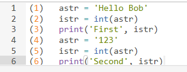

Q30: What will the value be for **istr after this code executes**?  **-1**

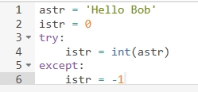

---------------------------------

**Assignment 3.1: **

Write a program to prompt the user for hours and rate per hour using input to compute gross pay.  Pay the hourly rate for the hours up to 40 and 1.5 times the hourly rate for all hours worked above 40 hours.  Use 45 hours and a rate of 10.50 per hour to test the program (the pay should be 498.75).

Additional: 可以增加讨论输入为字符串的错误情况

**Assignment 3.2: **

Write a program to prompt for a score between 0.0 and 1.0. If the score is out of range, print an error. If the score is between 0.0 and 1.0, print a grade using the following table:
 \>= 0.9     A; \>= 0.8     B; \>= 0.7     C; \>= 0.6     D; < 0.6      F
If the user enters a value out of range, print a suitable error message and exit. 

=======================================================================================

#### **Chapter 4-Functions**

store and reuse (存储和重用模式) 、以函数为载体   函数定义、调用   使用内置函数、定义函数   函数参数(定义、调用)   多参数   有返回值(fruitful function)/无返回值(non-fruitful function)

---------------

Q31: Which Python keyword indicates the start of a function definition?   **def**

Q32: In Python, how do you indicate the end of the block of code that makes up the function?

**You de-indent a line of code to the same indent level as the def keyword**

Q33: In Python what is the **input()** feature best described as?  **A built-in function**

Q34: What does the following code print out?  **There**

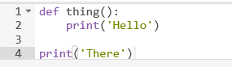

Q35*: In the following Python code, which of the following is an "argument" to a function?  **x**

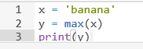

Q36: What will the following Python code print out?  **10	20**

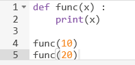

Q37: Which line of the following Python program will never execute?  **print('World')**

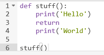

Q38: What will the following Python program print out?  **Bonjour Michael**

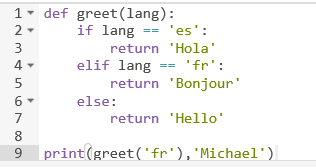

Q39: What will the following Python code print out?  **2**

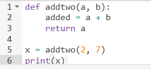

Q40: What is the most important benefit of writing your own functions?

**Avoiding writing the same non-trivial code more than once in your program**

------------

**Assignment 4:**

Write a program to prompt the user for hours and rate per hour using input to compute gross pay.  Pay should be the normal rate for hours up to 40 and time-and-a-half for the hourly rate for all hours worked above 40 hours. Put the logic to do the computation of pay in a function called **computepay()** and use the function to do the computation.

=======================================================================================

#### Chapter 5-Loops and Iteration

循环、循环变量(迭代变量)   避免无限循环   零循环   break语句跳出循环   continue语句跳至下一次迭代

不定循环：while循环中需构造循环变量  for循环中变量已经提前设置好

确定循环：for循环-寻找最大值、计数器、累加器、求平均数   循环+if语句-过滤器、查找、最小值

求最大最小值，最好不设初始标准数值，采用None(flag value)；is和is not都是运算符，比等号更严格

-------------

Q41: What is wrong with this Python loop:  **This loop will run forever**

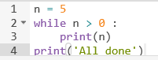

Q42: What does the **break** statement do?  **Exits the currently executing loop**

Q43: What does the **continue** statement do?  **Jumps to the top of the loop and starts the next iteration**

Q44: What does the following Python program print out?  **5**

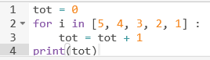

Q45: What is the iteration variable in the following Python code:  **friend**

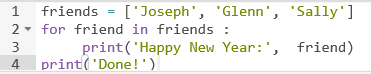

Q46: What is a good description of the following bit of Python code?  **Sum all the elements of a list**

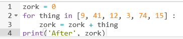

Q47: What will the following code print out?  **-1**

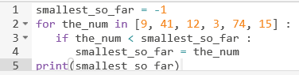

Q48: What is a good statement to describe the is operator as used in the following if statement:  **matches both type and value**

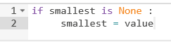

Q49: Which reserved word indicates the start of an "indefinite" loop in Python?  **while**

Q50: How many times will the body of the following loop be executed?  **0**

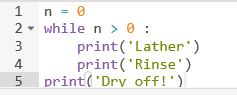

----------------

**Assignment 5:**

Write a program that repeatedly prompts a user for integer numbers until the user enters 'done'.  Once 'done' is entered, print out the largest and smallest of the numbers.  If the user enters anything other than a valid number catch it with a try/except and put out an appropriate message and ignore the number. Enter 7, 2, bob, 10,  and 4 and match the output below.

