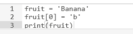
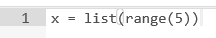
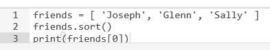

### Python for Everybody-Course 2: Python Data Structures

#### Chapter 6-Strings

字符串内位置索引从0开始   索引可以为表达式   字符串内字符不可改变-immutable     len返回字符串长度

采用while循环(len函数作为循环结束条件)、for循环(in关键字*)遍历字符串内全部字符

对字符串内字符判断、计数   字符串分割(前后序号选取、缺省时的含义)   字符串连接"+"

采用in关键字对字符串子串进行判定   字符串比较"比较运算符"   string library查看字符串全部可用操作

.lower()全部变小写   .upper()全部变大写   .capitalize()首字母变大写   .find()查找子串及其位置索引(首个结果)

.replace()查找子串并替换(全部)   .lstrip()去掉字符串左侧空格   .rstrip()右侧空格   .strip()首位空格

.startswith()查找字符串起始子串，区分大小写

---------------

Q51: What does the following Python Program print out?  **Hellothere**

Q52: What does the following Python program print out?  **42**

Q53: How would you use the index operator [] to print out the letter q from the following string?  **print(x[8])**

Q54: How would you use string slicing [:] to print out 'uct' from the following string?  **print(x[14:17])**

Q55: What is the iteration variable in the following Python code?  **letter**

Q56: What does the following Python code print out?  **42**

Q57: How would you print out the following variable in all upper case in Python?  **print(greet.upper())**

Q58: Which of the following is not a valid string method in Python?

​			**shout()**	split()	join()	startswith()

Q59: What will the following Python code print out?  **.ma**

Q60: Which of the following string methods removes whitespace from both the beginning and end of a string?  	**strip()**

---------------------------------------------------

**Assignment 6:**

Write code using find() and string slicing to extract the number at the end of the line below.   Convert the extracted value to a floating point number and print it out.

=======================================================================================

#### Chapter 7-Files

handle=open(filename,mode)	采用open函数 通过指定模式 生成文件处理器 	实际是字符串的序列 	文件中每行是一个单独的字符串 	通过for循环可访问每一行并计数 	在for循环内嵌入if循环(可同时使用in关键字)，输出符合条件的行字符串 采用rstrip()函数可以去除每行字符串后的换行符

inp=handle.read()	采用read函数将文件中全部内容写入一个字符串							\n 换行符实际是一个字符

-----------------

Q61: Given the architecture and terminology we introduced in Chapter 1, where are files stored?  

**Secondary memory**

Q62: What is stored in a "file handle" that is returned from a successful **open() call?**  

**The handle is a connection to the file's data**

Q63: What do we use the second parameter of the **open() call to indicate?**  

**Whether we want to read data from the file or write date to the file**

Q64: What Python function would you use if you wanted to prompt the user for a file name to open?  

**input()**

Q65: What is the purpose of the newline character in text files?  

**Indicates the end of one line of text and the beginning of another line of text**

Q66: If we open a file, what statement would we use to read the file one line at a time?  **for line in xfile:**

Q67: What is the purpose of the following Python code?  **Count the lines in the file 'mbox.txt'**

Q68: If you write a Python program to read a text file and you see extra blank lines in the output that are not present in the file input, what Python string function will likely solve the problem? 	 **rstrip()**

Q69: The following code sequence fails with a traceback when the user enters a file that does not exist.  How would you avoid the traceback and make it so you could print out your own error message when a bad file name was entered?	  **try/except**

Q70: What does the following Python code do?   **Reads the entire file into the variable inp as a string**

--------------------

**Assignment 7.1:**

Write a program that prompts for a file name, then opens that file and reads through the file, and print the contents of the file in upper case.  Use the file **words.txt** to produce the output.

**Assignment 7.2:**

Write a program that prompts for a file name, then opens that file and reads through the file, looking for lines of the form: 		X-DSPAM-Confidence:    0.8475

Count these lines and extract the floating point values from each of the lines and compute the average of those values and produce an output. 

=======================================================================================

#### Chapter 8-Lists

列表 元素放在**[ ]**中，各元素之间用，隔开	列表中元素可为不同类型

可采用for循环和in关键字遍历列表中的元素   采用位置索引访问列表中的元素、改变列表中元素-mutable

采用len函数计算list中元素个数	range()返回值为整数列表、从0开始

列表元素连接操作“+”	列表元素索引分割“:”	创建空列表、采用append()添加元素	采用in关键字判断元素是否存在	采用sort()对列表中元素排序，改变列表	max、min、len、sum进行比较计算

对字符串进行split()操作，分割得到列表作为返回值   默认采用空格分隔，也可设为";"	也可采用不同分割字符进行两次分割

--------------------

Q71: How are "collection" variables different from normal variables?

**Collection variables can store multiple values in a single variable**

Q72: What are the Python keywords used to construct a loop to iterate through a list?  **for/in**

Q73: For the following list, how would you print out 'Sally'?  **print(friends[2])**

Q74: What would the following Python code print out?  

**Nothing would print-the program fails with a traceback error**

Q75: Which of the following Python statements would print out the length of a list stored in the variable **data**?  	**print(len(data))**

Q76: What type of data is produced when you call the **range()** function?	  **A list of integers**

Q77: What does the following Python code print out?		**6**

Q78: Which of the following slicing operations will produce the list [12, 3]? 	 **t[2:4]**

Q79: What list method adds a new item to the end of an existing list? 	 **append()**

Q80: What will the following Python code print out? 	 **Glenn**

--------------------------------

**Assignment 8.1:**

Open the file **romeo.txt** and read it line by line.  For each line, split the line into a list of words using the **split()** method.   The program should build a list of words.  For each word on each line check to see if the word is already in the list and if not append it to the list. When the program completes, sort and print the resulting words in alphabetical order.

**Assignment 8.2:**

Open the file **mbox-short.txt** and read it line by line.  When you find a line that starts with 'From ' like the following line: 
From stephen.marquard@uct.ac.za Sat Jan  5 09:14:16 2008
You will parse the From line using split() and print out the second word in the line (i.e. the entire address of the person who sent the message).  Then print out a count at the end.

=======================================================================================

#### Chapter 9-Dictionaries

字典元素放在**{ }**中，可以被改变mutable	字典中元素为key-value对，存储顺序不固定，可按照键值对关系定义字典，字典可为空	采用字典可以处理统计、计数问题	访问字典中不存在的key值时会traceback，可采用in关键字判断字典中的key值

get()方法-对不存在的关键字默认返回0，已存在关键字返回value值，从而可以用来计数

for循环通过关键字遍历字典，或通过关键字和值两个迭代变量遍历字典

.keys()返回字典关键字列表；.values()返回字典值列表；.items()返回键值对元组列表，可通过两个迭代变量遍历

应用：寻找文件中出现最多次数最多单词及其出现频次

-----------------

Q81: How are Python dictionaries different from Python lists?  **Python lists maintain order and dictionaries do not maintain order**

Q82: What is a term commonly used to describe the Python dictionary feature in other programming languages?  **Associative arrays**

Q83: What would the following Python code print out?  **The program would fail with a traceback**

Q84: What would the following Python code print out?  **-1**

Q85: (T/F) When you add items to a dictionary they remain in the order in which you added them.  **False**

Q86: What is a common use of Python dictionaries in a program?  **Building a histogram counting the occurrences of various strings in a file**

Q87: Which of the following lines of Python is equivalent to the following sequence of statements assuming that **counts** is a dictionary?  **counts[key] = counts.get(key,0) + 1**

Q88: In the following Python, what does the **for** loop iterate through?  **It loops through the keys in the dictionary**

Q89: Which method in a dictionary object gives you a list of the values in the dictionary?  **values()**

Q90: What is the purpose of the second parameter of the **get()** method for Python dictionaries?  **To provide a default value if the key is not found**

--------

**Assignment 9:**

Write a program to read through the **mbox-short.txt** and figure out who has sent the greatest number of mail messages.  The program looks for 'From ' lines and takes the second word of those lines as the person who sent the mail.  The program creates a Python dictionary that maps the sender's mail address to a count of the number of times they appear in the file.  After the dictionary is produced, the program reads through the dictionary using a maximum loop to find the most prolific committer.

=======================================================================================

#### Chapter 10-Tuples

元组元素放在**( )**中，不可改变immutable	只有count()和index()两种方法	元组更有效	元组一一对应来定义

元组可以进行比较，按顺序比较内部元素判断大小	sorted()函数的reverse参数可设置排序方式

采用items()方法获得键值对元组列表，再采用sorted()对其进行排序--<根据key排序>

根据key-value对，构造value-key对，再采用sorted()排序--<根据value排序>

应用：查找文本中出现频次最高的十个单词

---------------

Q91: What is the difference between a Python tuple and Python list?

**Lists are mutable and tuples are not mutable**

Q92: Which of the following methods work both in Python lists and Python tuples?  **index()**

Q93: What will end up in the variable **y** after this code is executed?	**4**

Q94: In the following Python code, what will end up in the variable **y**?  	**A list of tuples**

Q95: Which of the following tuples is greater than **x** in the following Python sequence?	**(6,0,0)**

Q96: What does the following Python code accomplish, assuming the **c** is a non-empty dictionary?

**It creates a list of tuples where each tuple is a value,key pair**

Q97: If the variable **data** is a Python list, how do we sort it in reverse order?  **data.sort(reverse=True)**

Q98: Using the following tuple, how would you print 'Wed'?	**print(days[2])**

Q99: In the following Python loop, why are there two iteration variables (k and v)?

**Because the items() method in dictionaries returns a list of tuples**

Q100: Given that Python lists and Python tuples are quite similar - when might you prefer to use a tuple over a list?	**For a temporary variable that you will use and discard without modifying**

--------------------------

**Assignment 10:**

Write a program to read through the **mbox-short.txt** and figure out the distribution by hour of the day for each of the messages.  You can pull the hour out from the 'From ' line by finding the time and then splitting the string a second time using a colon.

From stephen.marquard@uct.ac.za Sat Jan  5 09:14:16 2008

Once you have accumulated the counts for each hour, print out the counts, sorted by hour as shown below.

